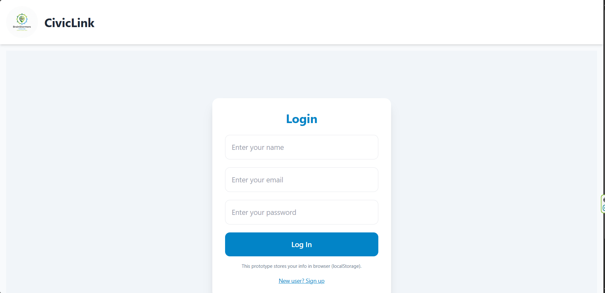
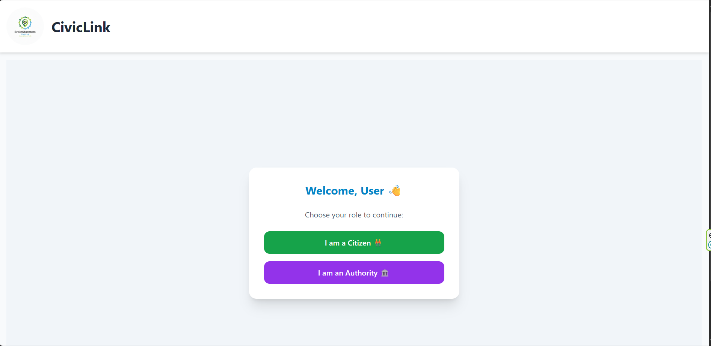
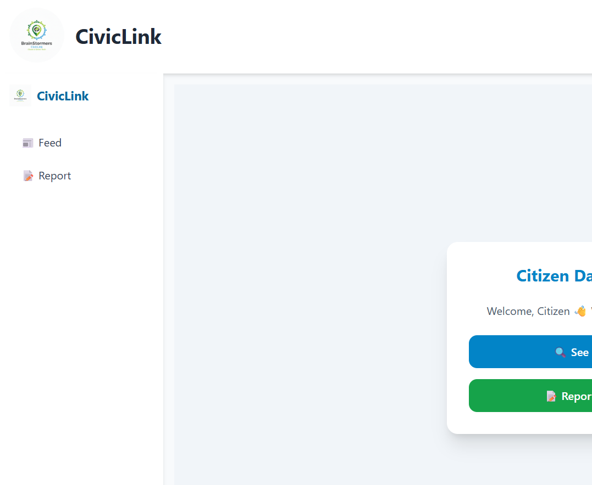
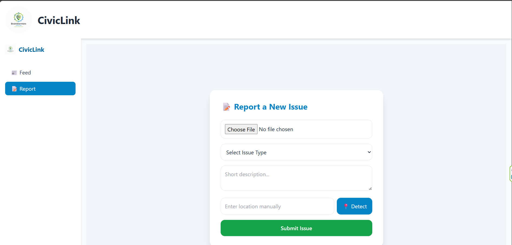
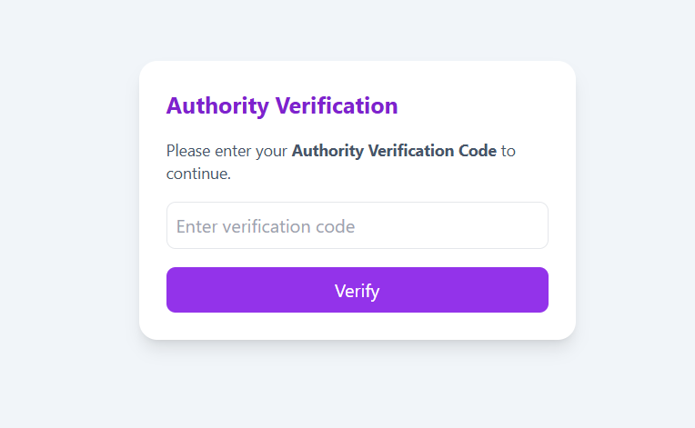
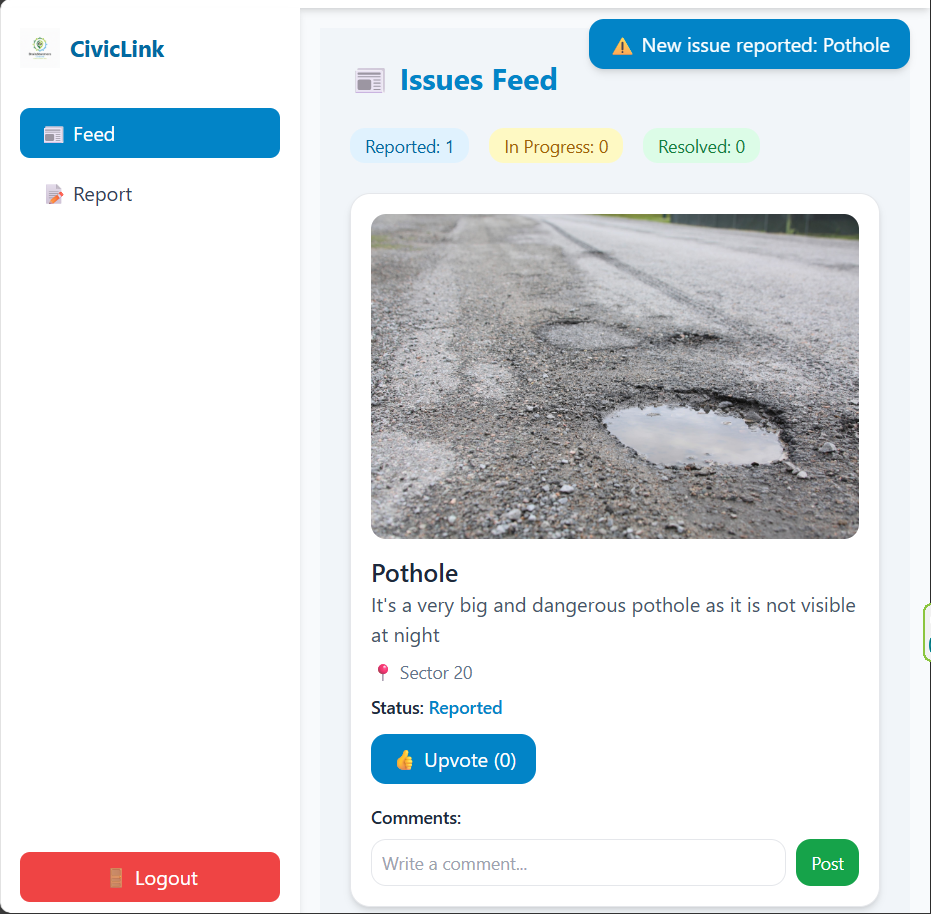
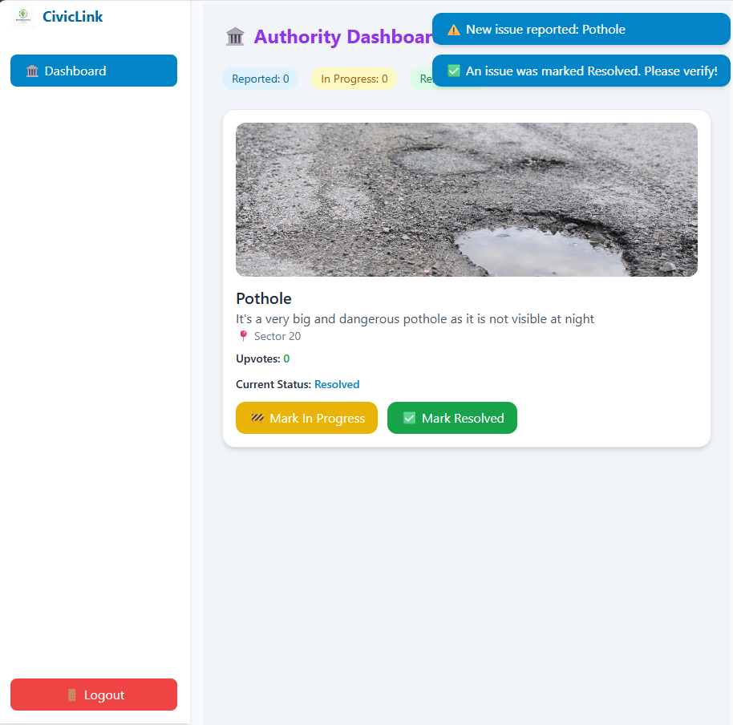

🏛️ CivicLink
CivicLink is a role-based civic engagement platform built with React, Vite, and Tailwind CSS. It empowers citizens to report issues and authorities to manage them through intuitive dashboards, real-time notifications, and a clean, responsive UI.

🚀 Features
- 📰 Citizen Feed – View public issues and updates
- 📝 Report Issues – Submit civic problems with location and description
- 🏛️ Authority Dashboard – Manage and resolve reported issues
- 🔐 Role-Based Access – Separate views for citizens and authorities
- 🔔 Notifications – Real-time alerts for new reports and resolutions
- 🎨 Responsive Design – Built with Tailwind CSS for sleek UI

🛠️ Tech Stack
- Frontend: React + Vite
- Styling: Tailwind CSS
- Routing: React Router
- State Management: useState, useEffect
- Storage: localStorage (for prototype)

📦 Installation
git clone https://github.com/PatelChirang/CivicLink.git
cd CivicLink
npm install
npm run dev

📸 Screenshots
## 📸 App Screenshots

📄 License
This project is licensed under the MIT License.

